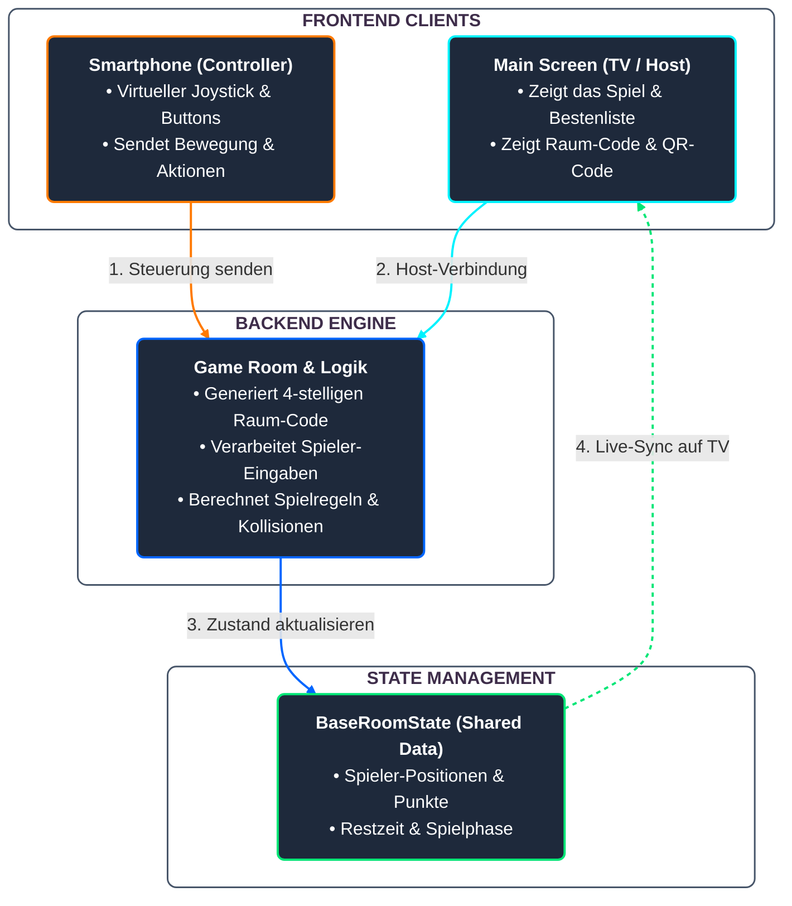
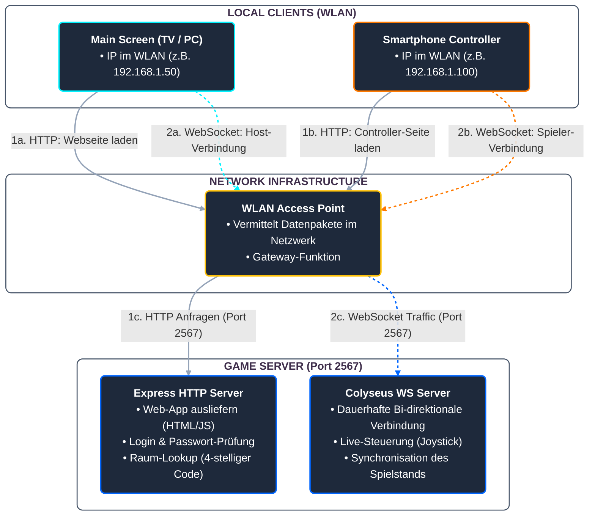
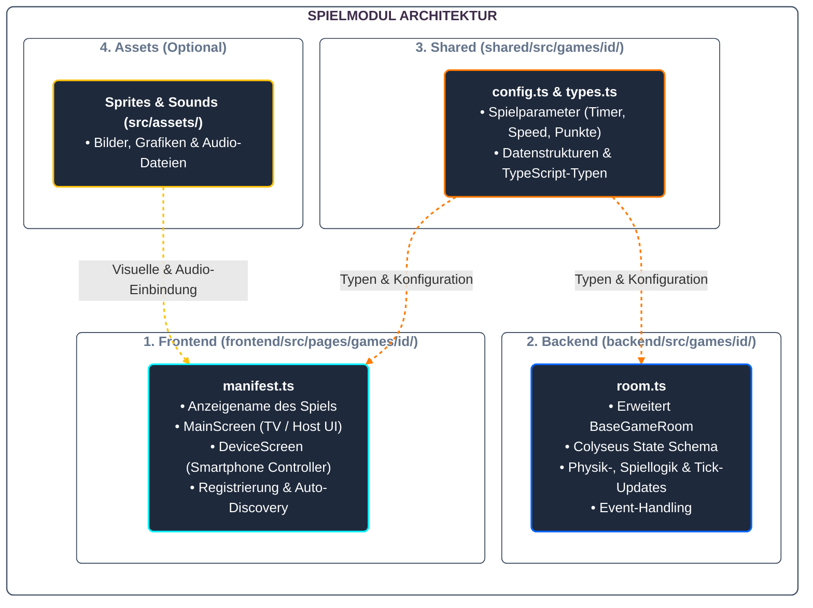

+++
title = "Das Framework"
weight = 20
draft = false
+++

# Das Framework
## ResQ nimmt einem Spiel alles ab, was nichts mit dem Spiel zu tun hat.


## Session & Verbindung

- QR-Code und automatische Verbindung
- Session-Management, Session-IDs
- Drop-In und Drop-Out, auch bei Inaktivität
 
## Spieler-Handling

- Namenszuweisung
- Farbzuweisung
- Verwaltung der Spieleranzahl

## Spielablauf

- Endlosloop mit Auswahl der Spiele
- Phasen-Handling: Connecting, Spiel läuft, Ergebnisse, Disconnecting
- Timer
- Scoring
- Leaderboard

## Darstellung

- MainScreen für den großen Bildschirm
- Device Screen für die Handys
- Frontend-UI-Gerüst und Routing



### Das Netzwerk


**Drei Dateien.** Mehr braucht es nicht, um ein neues Spiel in ResQ einzuhängen.

## 1. manifest.ts (Frontend-Manifest & UI-Registrierung): 
Deklariert den Anzeigenamen des Spiels sowie die React-Komponenten für den Hauptbildschirm (MainScreen) und die Controller-Ansicht (DeviceScreen), worüber die automatisierte Discovery und Routen-Einbindung im Frontend erfolgt.
## 2. room.ts (Backend-Serverlogik): 
Beinhaltet die serverseitige Zustandsverwaltung (Colyseus Schema), die Physik- und Spiellogik-Updates sowie das Event-Handling durch Ableitung von BaseGameRoom.
## 3. config.ts (Shared Config & Typen): 
Stellt spielspezifische Parameter (z. B. Spawntimer, Geschwindigkeiten, Punkte) und Datenstrukturen bereit, die sowohl vom Backend als auch vom Frontend gemeinsam genutzt werden.

Und natürlich noch Assets, falls hier ein spezielleres Spiel gebaut wird.



Nach der Umstellung sind drei weitere Spiele entstanden – Quiz, Memory und Schlauchstaffel. Alle drei wurden KI-gestützt umgesetzt: Wir haben die Framework-Konventionen in einer AGENTS.md dokumentiert, sodass ein Coding-Agent neue Spielmodule regelkonform erzeugen kann. Dass das funktioniert, ist selbst ein Beleg für die Klarheit der Schnittstelle: Was eine Maschine aus der Doku bauen kann, kann auch ein fremdes Team bauen.
