+++
title = "Der Prozess"
weight = 10
draft = false
+++

# Der Prozess

## Unsere Aufgabe war es, die Wartezeit am Messestand der Jugendfeuerwehr durch ein Public Game zu verkürzen. Im Laufe der Entwicklung und nach den ersten Praxistests wurde uns jedoch klar, dass darin noch viel mehr Potenzial steckt. Deshalb haben wir aus dem ursprünglichen Spielkonzept ein eigenständiges Framework gebaut, in das sich flexibel neue Minispiele einbinden lassen.

```mermaid
flowchart TB
    %% Visuelle Themes & Styles
    classDef startPhase fill:#1e293b,stroke:#ff4d4d,stroke-width:2px,color:#ffffff,rx:6px,ry:6px;
    classDef researchPhase fill:#1e293b,stroke:#ff7a00,stroke-width:2px,color:#ffffff,rx:6px,ry:6px;
    classDef conceptPhase fill:#1e293b,stroke:#ffc107,stroke-width:2px,color:#ffffff,rx:6px,ry:6px;
    classDef devPhase fill:#1e293b,stroke:#0066ff,stroke-width:2px,color:#ffffff,rx:6px,ry:6px;
    classDef testPhase fill:#1e293b,stroke:#00f2fe,stroke-width:2px,color:#ffffff,rx:6px,ry:6px;
    classDef milestonePhase fill:#1e293b,stroke:#00e676,stroke-width:2px,color:#ffffff,rx:6px,ry:6px;

    %% Subgraph Styling (Transparent)
    style PROCESS fill:none,stroke:#475569,stroke-width:0px,color:#3e2d4a,rx:8px;

    %% Nodes
    subgraph PROCESS ["<b>PROJEKTVERLAUF & ENTWICKLUNGSPHASEN</b>"]
        direction TB

        A["<b>Herausforderung</b><br/>• Kinder warten am Messestand der Jugendfeuerwehr"]
        B["<b>Interviews in Luckenwalde</b><br/>• Wünsche & Anforderungen ermitteln<br/>• Verfügbarkeit von Handys prüfen"]
        C["<b>Recherche</b><br/>• Vergleichbare Spiele & Interaktionsformen"]
        D["<b>Konzeption</b><br/>• 11 Spielideen entwickelt"]
        F["<b>Wassermarsch v0.0.1</b><br/>• Erstes Spiel als Prototyp"]
        G["<b>1. Nutzer-Test</b><br/>• Erprobung bei der Jugendfeuerwehr"]
        H["<b>Entwicklung Framework</b><br/>• Basis-Architektur aufbauen"]

        I["<b>Entwicklung weitere Spiele</b><br/>• Lösch-Quiz<br/>• Feuerwehr-Memory<br/>• Schlauchstaffel"]
        J["<b>Wassermarsch v0.0.2</b><br/>• Weiterentwicklung Spiel 1"]

        N["<b>Validierung des Frameworks</b><br/>• Überprüfung der Modul-Architektur"]
        L["<b>2. Nutzer-Test</b><br/>• Feedback von IMI-Studierenden"]
        M["<b>3. Nutzer-Test</b><br/>• Erneute Erprobung bei der Jugendfeuerwehr"]

        Q["<b>Wassermarsch v0.0.3</b><br/>• Finale Überarbeitung Spiel 1"]
        O["<b>Stand heute</b><br/>• ResQ-Framework mit vier fertigen Spielen"]
        P["<b>Ausblick</b><br/>• Neue Spiele einfach andocken"]
    end

    %% Ablauf-Verbindungen
    A ==> B
    B ==> C
    C ==> D
    D ==> F
    F ==> G
    G ==> H

    %% Parallele Stränge aus H
    H --> I
    H --> J

    I --> N
    J --> L
    L --> M
    M --> Q

    N ==> O
    Q ==> O
    O -. "Zukünftige Erweiterung" .-> P

    %% Class Assignments
    class A startPhase;
    class B,C researchPhase;
    class D conceptPhase;
    class F,H,I,J,Q devPhase;
    class G,L,M,N testPhase;
    class O,P milestonePhase;

    %% Link Styling
    linkStyle 0,1,2,3,4,5 stroke:#94a3b8,stroke-width:2px;
    linkStyle 6,7 stroke:#0066ff,stroke-width:2px;
    linkStyle 8 stroke:#0066ff,stroke-width:2px;
    linkStyle 9,10,11 stroke:#00f2fe,stroke-width:2px;
    linkStyle 12,13 stroke:#00e676,stroke-width:2px;
    linkStyle 14 stroke:#00e676,stroke-width:2px,stroke-dasharray: 4 4;
```


Beim ersten Termin bei der Jugendfeuerwehr Luckenwalde haben wir leitfadengeführte Interviews mit kleinen Gruppen von 2 bis 3 Kindern und Jugendlichen (10 bis 15 Jahre) durchgeführt, um ihre Wünsche, Ideen und Anforderungen aufzunehmen.

Drei Erkenntnisse haben unser Projekt von Beginn an geprägt:

- **Eigenes Handy vorhanden:** Fast alle Kinder besitzen ein Smartphone. Das hat unseren Bring-Your-Own-Device-Ansatz (BYOD) gestützt.
- **Miteinander statt allein:** Die Kinder wollen gemeinsam oder gegeneinander spielen – reine Singleplayer-Spiele machen auf Dauer wenig Spaß.
- **Gewohnte Steuerung:** Bedienelemente wie digitale Joysticks kennen die Kinder bereits bestens aus Spielen wie Brawl Stars, Fortnite oder Animal Crossing.

Der größte konkrete Spielwunsch: Brandbekämpfung.

Zusätzlich gab es ein paar feste Rahmenbedingungen von unseren Betreuern:

- Keine aktive Internetverbindung nötig (reines Lokales Netz)
- Einfacher Drop-In und Drop-Out für wechselnde Gruppen
- Geeignet für große Gruppen am Messestand









Anschließend haben wir vergleichbare Titel im Bereich Public Games sowie Feuerwehr-Spiele analysiert. Dazu gehörten unter anderem Kahoot, Terra-2042, ein Skribbl.io-Klon, ein Online-Escape-Game zur Brandschutzerziehung sowie jeweils zehn Spiele von GamesforCrowds und Gaming Couch.

Parallel dazu haben wir mögliche Interaktionsformen auf dem Smartphone evaluiert und in ersten Prototyping-Ansätzen erprobt. Dabei untersuchten wir unter anderem die Einbindung virtueller Joysticks für ein vertrautes Controller-Gefühl, den Zugriff auf Gyroskop-Sensoren zur Bewegungssteuerung sowie auditives Feedback. Ziel war es, die Bedienung für das Messe-Setting so intuitiv wie möglich zu gestalten.




Aus den Interviews und der Recherche sind insgesamt **11 Spielideen** entstanden. Um direkt ins Tun zu kommen und eine erste funktionsfähige Lösung zu haben, haben wir uns für die Umsetzung einer konkreten Idee entschieden: Wassermarsch.

## Wassermarsch

Wassermarsch hat alle wichtigen Kriterien auf einmal abgedeckt: Es greift den Wunsch nach Brandbekämpfung auf, lässt sich kooperativ wie auch kompetitiv spielen, läuft rundenbasiert mit schnellem Drop-In und Drop-Out und testet genau die gewünschte Steuerung per Joystick und Button.




Die ersten Version stand als klassischer Prototyp: Ein MainScreen für den großen Bildschirm, beliebig viele Smartphones als Controller via QR-Code-Scan, eine funktionierende Game-Loop sowie erste Grafik-Assets und Kollisionen.




Mit der Version v0.0.1 ging es zurück nach Luckenwalde. Wir wollten drei Dinge wissen: Funktioniert die Spielidee? Passt die Steuerung? Und wie stabil läuft die Verbindung unter echten Bedingungen?

Der Test hat die Spielidee zwar voll bestätigt, zeigte aber auch Schwachstellen: Bei vielen Geräten gab es Verbindungsprobleme, und die Steuerung brauchte noch etwas Erklärung. Als Konsequenz haben wir die Sensor-Toleranz des Joysticks angepasst und das Session-Handling im Backend optimiert, um Verbindungsabbrüche beim Ein- und Aussteigen nahtlos abzufangen.




Nach dem Beta-Test wurde uns klar: Ein einzelnes Spiel reicht auf Dauer nicht aus. Ein Messestand braucht Abwechslung, damit die Kinder auch beim zweiten oder dritten Besuch wiederkommen. Außerdem passt je nach Event – ob Stadtfest oder Tag der offenen Tür – ein anderes Spiel besser.

Deshalb haben wir den Kurs erweitert: Aus Wassermarsch sollte kein Einzelprojekt bleiben, sondern das erste Modul einer ganzen Plattform werden.

Es folgte die aufwendigste Phase des Projekts: Wir haben Wassermarsch komplett entkoppelt. Alles Generische – QR-Verbindung, Session-Handling, Scoring, Timer, Leaderboard und Screen-Management – haben wir in ein eigenständiges Framework überführt. Wassermarsch wurde damit zum ersten Minispiel-Modul, und aus unseren restlichen 11 Ideen wurde ein Backlog für zukünftige Spiele.




Ab hier lief die Entwicklung zweigleisig:

1. **Entwicklung weiterer Spiele:** Um zu beweisen, dass unser Framework flexibel funktioniert, haben wir drei neue Minispiele entwickelt (Lösch-Quiz, Feuerwehr-Memory und Schlauchstaffel).

2. **Weiterentwicklung von Wassermarsch:** Parallel bekam Wassermarsch in Version v0.0.2 eine richtige Map, neue Assets sowie Animationen für Punktegewinne, Punkteverluste und Kollisionen.




In der Validierungsphase liefen beide Stränge wieder zusammen: Das Framework hat sich durch die Einbindung der drei neuen Spiele bewährt, während Wassermarsch und die weiteren Module in Nutzertests auf Herz und Nieren geprüft wurden. Details dazu finden sich auf der Testing-Seite.


